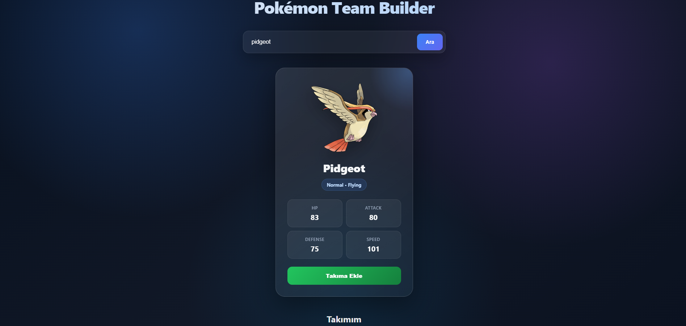

# Pokémon Team Builder ⚡

Pokémon Team Builder is a full-stack web application that allows users to search for Pokémon and build their own Pokémon team.

This project was developed as a team project to practice **Git/GitHub workflows, REST APIs, frontend-backend communication, and database operations**.
## 📸 Screenshot



## 🚀 Features

- Search for Pokémon by name or ID
- Fetch real Pokémon data from PokéAPI
- Display Pokémon images, types, and stats
- Add Pokémon to a team
- Remove Pokémon from the team
- Store team data in an SQLite database
- Keep team data after refreshing the page
- Modern and responsive user interface

## 🛠️ Technologies

### Frontend
- HTML
- CSS
- JavaScript
- Fetch API

### Backend
- Node.js
- Express.js

### Database
- SQLite
- sqlite3

### External API
- PokéAPI

### Version Control
- Git
- GitHub
- Feature Branches
- Pull Requests

## 🔄 How It Works

```text
User
 ↓
Frontend
 ↓
Express Server
 ↓
PokéAPI
 ↓
JSON Response
 ↓
Frontend
```

Team operations use a separate flow:

```text
Frontend
 ↓
/api/team
 ↓
Express Server
 ↓
SQLite Database
```

When a user searches for a Pokémon, the frontend sends a request to the Express server. The server retrieves the Pokémon data from PokéAPI and returns a formatted JSON response.

When a Pokémon is added to the team, its information is stored in the SQLite database. This allows the team to remain available even after the page is refreshed.

## 📡 API Endpoints

### Get Pokémon

```http
GET /api/pokemon/:identifier
```

Example:

```text
/api/pokemon/pikachu
```

### Get Team

```http
GET /api/team
```

### Add Pokémon to Team

```http
POST /api/team
```

Example request body:

```json
{
  "name": "Pikachu",
  "type": "electric",
  "image": "https://..."
}
```

### Remove Pokémon from Team

```http
DELETE /api/team/:id
```

## 💻 Installation

Clone the repository:

```bash
git clone <repository-url>
```

Navigate to the project directory:

```bash
cd calisma
```

Install the required dependencies:

```bash
npm install
```

Start the server:

```bash
node server.js
```

Open the application in your browser:

```text
http://localhost:3000
```

## 🌿 Git Workflow

The project was developed by dividing the work into separate feature branches:

```text
main
│
├── feature/pokemon-api
├── feature/database
└── feature/frontend
```

Each feature was developed independently and then integrated into the `main` branch using Pull Requests.

This workflow allowed the team to practice real-world Git concepts such as branching, commits, merging, resolving changes, and Pull Requests.

## 👥 Team

This project was developed by a team of three developers.

- **Backend & PokéAPI** — Express server and PokéAPI integration
- **Database** — SQLite database and team CRUD operations
- **Frontend** — User interface, Fetch API integration, and team interactions

## 🎯 Project Goals

The main goal of this project was to gain practical experience with:

- Git branch management
- GitHub Pull Requests
- Team-based development
- REST API development
- Fetch API
- Async / Await
- JSON data handling
- Express.js routing
- CRUD operations
- SQLite
- Frontend-backend integration

## 📖 What We Learned

Through this project, we practiced how different parts of a full-stack application communicate with each other and how multiple developers can work on separate features using Git branches before combining their work into a single application.